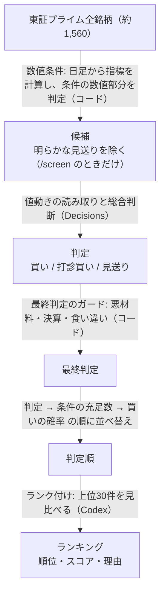

# 設計と考え方

株分析シミュレーターが何を根拠に「買い / 打診買い / 見送り」を出し、どう並べているかをまとめる。
起動の仕方と使い方は [README.md](README.md)、サーバー内部と外部サービスのやりとりは [docs/sequence.md](docs/sequence.md) を参照。

> 選択した売買ルールに照らした機械的な判定のサンプルであり、投資助言ではない。利用は自己責任で、作者は一切の責任を負わない（[README の免責事項](README.md#免責事項)）。

## 銘柄の選び方

### 判定の流れ



| 段階               | 担当      | やること                                                                    |
| ------------------ | --------- | --------------------------------------------------------------------------- |
| 数値条件           | コード    | 日足（Yahoo Finance、終値ベース）から指標を計算し、条件の数値部分を判定     |
| 値動きの読み取り   | Decisions | 数値だけでは決まらない条件（下げ止まり / トレンド中の押し目か）の確率を出す |
| 総合判断           | Decisions | ルールの要約・指標・条件の判定結果から、買い / 打診買い / 見送りを選ぶ      |
| 最終判定のガード   | コード    | 悪材料・決算・値動きの読み取りと総合判断の食い違いで、判定を下げる          |
| ランク付け         | Codex     | 判定順の上位30件を比べ、有望な順に並べる                                    |

Decisions は、AI に1銘柄ずつ選択肢の決まった問いに答えさせる判定を指す（使う AI と送り方は「AI の使い分け」を参照）。
`/judge`（銘柄を指定して調べる）は候補の絞り込みをせず、指定した銘柄をすべて値動きの読み取りに進める。

### 2つの売買ルール

銘柄判定には、順張りの「スイング」（既定）と逆張りの「急落リバウンド」の2つのルールがある。
それぞれテクニカル指標に基づく買い条件（スイングは5条件、急落リバウンドは4条件）を定義し、条件の充足数と AI の定性判断を組み合わせて判定する。

|                               | スイング（`swing`、既定）                                                  | 急落リバウンド（`rebound`）                              |
| ----------------------------- | -------------------------------------------------------------------- | -------------------------------------------------------------- |
| 狙い                          | 上昇トレンド中の一時的な押し目（上昇の途中の休み）                   | 大型株が材料なしに急落したところ（下落の行きすぎ）             |
| 方向                          | 順張り                                                               | 逆張り                                                         |
| 前提                          | 上昇トレンドは続き、押し目のあとまた上がる                           | 材料のない急落は需給の乱れで、25日線まで戻る                   |
| 保有期間                      | 3日〜2週間（最長10営業日）                                           | 2〜3日〜1ヶ月（最長20営業日）                                  |
| 買いの条件                    | 5条件（上昇トレンド・25日線押し目・RSI・反転シグナル・出来高）       | 4条件（前日比・25日線乖離・-2σ・RCI）                          |
| AI に補わせる条件             | 25日線への押し目の後半「トレンドが崩れていないか」                   | 25日線乖離の後半「下げ止まりの兆し」                           |
| 候補から外す銘柄（`/screen`） | 上昇トレンドを満たさない、または満たした条件が2つ以下の銘柄          | 上記4条件を1つも満たさない銘柄                                 |
| AI なしのときの判定           | 5条件すべてで「買い」、上昇トレンドを含む4条件で「打診買い」          | 4条件すべて満たしても「打診買い」まで（下げ止まり未確認のため） |
| 条件の揃いやすさ              | 急落リバウンドより揃いやすい                                         | まれ（相場が大きく崩れた日に限られる）                         |

### スイング（`swing`）

上昇トレンド中の銘柄が25日線付近まで押し、反転し始めたタイミングで買い、直近高値（および25日線割れ）で利確、押し目の安値を終値で割ったら損切りする。

```text
株価
 │                                    ╱ ← 第1目標: 直近20日の高値で半分を利確
 │             ╱╲                   ╱
 │      ╱╲   ╱    ╲               ╱ ← 反転シグナルを確認して買う
 │    ╱    ╲╱      ╲            ╱
 │  ╱   上向きの25日線 ╲_______╱ ← 25日線まで押す（出来高は少なめ）
 │ ─ ─ ─ ─ ─ ─ ─ ─ ─ ─ ─ ─ ─ ─ ─ ← 押し目の安値などを終値で割ったら損切り
 │ ════════════ 75日線 ════════════  （終値・25日線とも75日線より上 = 上昇トレンド）
 └────────────────────────────────────── 時間
```

| 買いの5条件      | 基準                                                                     | 見ているもの                               |
| ---------------- | ------------------------------------------------------------------------ | ------------------------------------------ |
| 上昇トレンド     | 終値 > 75日線、25日線 > 75日線、25日線が上向き                           | そもそも上昇トレンドか                     |
| 25日線への押し目 | 直近5日の安値が25日線+2%以内、終値が25日線−2%以上 ＋ トレンド維持（AI） | 25日線まで下げたが、割り込んではいないか   |
| RSI(14)          | 40〜60                                                                   | 過熱しておらず、弱りすぎてもいないか       |
| 反転シグナル     | 終値が前日高値を上抜く、または直近3日で MACD ゴールデンクロス            | 押し目から再び上がり始めたか               |
| 押しの出来高     | 直近5日平均 < 25日平均                                                   | 売り崩しではなく、利益確定による軽い押しか |

| 売り方     | 内容                                                                                     |
| ---------- | ---------------------------------------------------------------------------------------- |
| 損切り     | 押し目の安値（直近5日）と「25日線 − 0.5ATR(14)」のうち近い方を終値で割ったとき          |
| 第1目標    | 直近20日の高値で半分を利確（値幅が損切り幅の1.5倍未満なら、損切り幅の1.5倍を目標にする） |
| 第2目標    | 終値で25日線を割ったら残りを手仕舞い                                                     |
| 利確の検討 | RSI(14) が70以上で過熱、80以上 / MACD のデッドクロス                                     |
| 時間切れ   | 5営業日で損切り幅ぶん上がらなければ建値で撤退。最長10営業日                              |

| 判定     | AI に渡している説明                                                      |
| -------- | ------------------------------------------------------------------------ |
| 買い     | 上昇トレンド中の押し目で反転も確認でき、条件がほぼ揃っている             |
| 打診買い | トレンドと押し目は揃っているが、反転や出来高の確認が弱い。少量で試す程度 |
| 見送り   | 上昇トレンドでない、押し目になっていない、または反転していない           |

- AI には直近20営業日の高値・安値・終値・出来高を渡し、「高値・安値の切り上げが崩れていない一時的な押し目か」を聞く。安値の切り下げや急落はトレンドの終わりと見て、25日線への押し目の条件を満たさないとする
- ルールの要約として「シグナルが1つだけならダマシを警戒して見送る」「直近高値までの値幅が損切り幅の1.5倍以上が望ましい」も渡す
- 出典: [20 Moving Average Pullback Strategy](https://www.tradingsim.com/blog/20-moving-average-pullback)（TradingSim）、[株のスイングトレードで勝つための10の必須ルール](https://crexgroup.com/ja/sec/stock-investment/swing-trade-rules/)（証券会社比較なび）、RSI・MACD の一般的な売買シグナル
- 実行例（2026-09-18 終値）: 候補626件で「買い」18件、「打診買い」192件、「見送り」416件

### 急落リバウンド（`rebound`）

材料のない急落で売られすぎた大型株が、下げ止まったタイミングで買い、25日線（または急落前の水準）まで戻したら利確、−3σを終値で割ったら損切りする。

```text
株価
 │ ─────────── 25日線 ──────────────────── ← 利確（25日線乖離・-2σで買ったとき）
 │  ╲
 │   ╲  前日比 -2.5%以下の急落
 │    ╲
 │ ─ ─ ╲─ ─ ─ ─ -2σ ─ ─ ─ ─ ─ ─ ─ ─ ─ ─ ← ボリンジャーバンド -2σ 以下
 │      ╲     ╱ ← 下げ止まりを確認して買う（AI が判定）
 │       ╲___╱
 │ ─ ─ ─ ─ ─ ─ ─ -3σ ─ ─ ─ ─ ─ ─ ─ ─ ─ ─ ← 終値で割ったら損切り
 └────────────────────────────────────────── 時間
```

| 買いの4条件        | 基準                               | 見ているもの               |
| ------------------ | ---------------------------------- | -------------------------- |
| 前日比             | −2.5%以下                          | 大型株として異常な下げか   |
| 25日線乖離         | −3%以下 ＋ 下げ止まりの兆し（AI）  | 適正価格から大きく離れたか |
| ボリンジャーバンド | −2σ以下                            | 統計的に売られすぎか       |
| RCI(10)            | −90%以下（教科書の−80%より厳しく） | 短期的に売られすぎか       |

| 売り方 | 内容                                                                                                                                 |
| ------ | ------------------------------------------------------------------------------------------------------------------------------------ |
| 利確   | 前日比の急落で買ったら「前日比−2.5%の水準」、25日線乖離・-2σで買ったら「当日の25日線」まで戻したとき（買った理由と売る理由を一致させる） |
| 損切り | 買った時点の −3σ を終値で割ったとき（逆指値で置く）                                                                                  |
| 保有中 | 25日線は毎日動くので利確の指値は毎朝出し直す / 悪材料が出たら即撤退 / 決算はまたがない                                               |

| 判定     | AI に渡している説明                                                           |
| -------- | ----------------------------------------------------------------------------- |
| 買い     | 買いの条件が十分に揃い、下げ止まりも見えている。悪材料もない                  |
| 打診買い | 条件は一部しか揃わないが、売られすぎで反発が見込める。100株だけ試しに買う程度 |
| 見送り   | 条件が揃わない、下げ止まっていない、または悪材料がある。入らないのが正解      |

- AI には直近10営業日の終値を渡し、「下落が止まり反転しつつあるか」を聞く。ルールの要約として「4つ全部揃うことは稀。迷ったら入らない」も渡す
- 大型株の逆張り手法（ちょる子式）をベースに実装している。指標の計算式は `src/technicals.ts`
- 実行例（2026-09-18 終値、Jev で判定していた時点）: 候補254件で、満たした条件は最多2つ。「買い」「打診買い」は0件

### 最終判定のガード（両ルール共通）

| ガード        | 条件                                                     | 結果                   | 理由                                           |
| ------------- | -------------------------------------------------------- | ---------------------- | ---------------------------------------------- |
| 悪材料        | ニュースを渡したときに、悪材料の確率が50%以上            | 見送り                 | 材料のある値動きはテクニカルどおりに戻りにくい |
| 決算          | 決算の材料をオンにしていて、発表まで5営業日以内          | 見送り                 | 決算はまたがない。最短の保有期間も取れない     |
| 食い違い      | 総合判断が「買い」なのに、値動きの読み取りの確率が50%未満 | 打診買いに下げる       | 総合判断と値動きの読み取りが食い違うことがある |
| AI を使えない | Decisions を使えない、または呼び出しに失敗した           | 数値条件の数だけで判定 | ルールごとの基準は「2つの売買ルール」の表      |

## テクニカル以外の材料（決算・ニュース）と判定の関係

| 材料     | 取得元                                                                                                                                                                 | 判定での扱い                                                                                                                      |
| -------- | ---------------------------------------------------------------------------------------------------------------------------------------------------------------------- | --------------------------------------------------------------------------------------------------------------------------------- |
| 決算     | JPX の[決算発表予定日](https://www.jpx.co.jp/listing/event-schedules/financial-announcement/index.html)（確定）。載っていなければ Yahoo Finance の予定日（推定を含む） | 発表まで5営業日以内なら「見送り」。保有期間中なら、懸念点と売り方に「決算の前に手仕舞う」を出す。Decisions と Codex にも渡す      |
| ニュース | Google ニュースの RSS（直近7日の見出し、最大10件）                                                                                                                     | 見出しを Decisions に渡し、悪材料の確率が50%以上なら「見送り」。自分で貼ったニュースと合わせて渡す。Codex には見出しを5件まで渡す |

決算・ニュースを渡すときは、Decisions に渡すルールの説明に次の2つを足す。

- 決算はまたがない。保有期間中に決算があるなら、その前に利確できる見込みがあるときだけ入る
- ニュースに悪材料があれば見送る。値動きの理由になる材料が出ているときは需給の乱れではないので、テクニカルの条件どおりには戻りにくい

JPX の一覧には、発表日が決まった会社だけが載る。決まっていない会社は Yahoo の推定日を使い、UI では推定と分かるように表示する。
発表までの営業日は、土日だけを除いて数えている（祝日は営業日として数えている）。

## AI の使い分け

数値で確定できる処理はコードで計算し、AI には「値動きの形を読む」「ニュースを読む」「条件が揃わないときの判断」「候補どうしを比べて並べる」といった定性的な判断だけを任せる。

AI の担当は大きく2つに分かれる。

1. **Decisions（銘柄ごとの個別判定）**: 1銘柄ずつ選択肢の決まった問い（問い + 選択肢 + 文脈 → 選択肢の1つと確率）に答えさせる。OpenAI の Decisions API と同じ形式のため、このツールでは Decisions と呼ぶ。
2. **ランク付け（全体比較）**: 判定を終えた上位銘柄を見比べ、有望な順に並べる。

| 担当       | やること                                                                                   | そう分けた理由                                                                                            |
| ---------- | ------------------------------------------------------------------------------------------ | --------------------------------------------------------------------------------------------------------- |
| コード     | テクニカル指標の計算、条件の数値部分の判定、売り方（利確・損切り）の計算、最終判定のガード | 同じ入力から同じ結果を出す必要があり、AI に任せる理由がない                                               |
| Decisions  | 1銘柄ごとの判定（値動きの形・悪材料・総合判断）                                            | 選択肢の決まった問いなので、軽いモデルで答えられる。スキャンの候補は数百件あり、1件あたりの速さを優先する |
| ランク付け | 判定済みの銘柄（上位30件）をまとめて比べ、順位・スコア・理由を付ける                       | 銘柄どうしの比較は、1件ずつの判定からは出てこない。対象が30件までなので、判定より推論を深くできる         |

Decisions に使う AI は、画面の設定ダイアログで Codex（既定）と Jev から選ぶ。
ランク付けは、どちらを選んでも Codex で行う。
Codex は Codex App Server を通して呼び、認証には Codex CLI のログイン（ChatGPT アカウント）をそのまま使うので、API キーを持たずに動かせる。
Codex で使うモデルも設定ダイアログで選び（既定は `gpt-6-luna`）、Decisions とランク付けでは推論の深さだけを変える（Decisions は `low`、ランク付けは `medium`）。

AI を使えないときや呼び出しに失敗したときも、全体は止めない。
Decisions を使えなければ数値条件だけで判定し（「最終判定のガード」）、失敗の内容を懸念点（`concerns`）に出す。
ランク付けを使えなければ判定順のまま返し、失敗の内容をトップレベルの `ranking.error` に出す。

### Codex App Server の使い方

`codex app-server`（stdio の JSON-RPC）のプロセスを1つだけ立ち上げて使い回し、問い合わせごとに使い捨てのスレッド（`ephemeral`）で1ターンだけ回す。
リポジトリやファイルを読ませないよう、作業ディレクトリは OS の一時ディレクトリ、サンドボックスは読み取り専用、承認は求めない設定にし、渡したデータだけで判断させる。
答えの形は `outputSchema`（JSON Schema）で固定する。プロセスが落ちていたら、次の問い合わせのときに立ち上げ直す。

### Decisions（銘柄ごとの判定）

Decisions の送り先は、設定ダイアログで選んだ AI で決まる（設定は `data/settings.json` に保存する）。

| 判定の AI       | 送り先                                                                           | 送り方                                                                                    |
| --------------- | -------------------------------------------------------------------------------- | ----------------------------------------------------------------------------------------- |
| `codex`（既定） | Codex App Server。モデルは設定の Codex のモデル（既定 `gpt-6-luna`、推論 `low`） | 20件ずつ1ターンにまとめ、同時に6ターンまで回す（`src/ai/decisions-codex.ts`）             |
| `jev`           | TypeSafe AI の Jev（判定専用の API。`systemOne`）                                | 1銘柄ずつ1リクエスト、同時8件まで（`src/ai/decisions-jev.ts`）。`TYPESAFE_API_KEY` が要る |

どちらに送っても、渡すもの（ルールの要約・指標・条件の判定結果・ニュース・決算）と返ってくる形は同じで、`src/ai/decisions.ts` が振り分ける。
既定を Codex にしているのは、API キーなしで動かせるからである。

Codex で1ターンに1銘柄ずつ聞くと、スキャンの候補が数百件あるので時間がかかる。
そこで呼ばれた銘柄をためておき、まとめて1ターンで聞く。
急落リバウンドで候補728件をスキャンしたとき、10件ずつ・同時4ターンでは約6分、20件ずつ・同時6ターンでは約4分かかった（2026-10-03 計測、ランク付けを含む）。
まとめて聞く銘柄には通し番号の `id` を付けて答えと突き合わせ、答えに含まれなかった銘柄だけを数値条件の判定に切り替える。

各銘柄について、次の3つを聞く。

| 問い          | 答えの形                                    | 使い方                                         |
| ------------- | ------------------------------------------- | ---------------------------------------------- |
| `qualitative` | 確率                                        | 数値だけでは決まらない条件を補う（ルールごと） |
| `verdict`     | 買い / 打診買い / 見送り と、それぞれの確率 | 総合判断。確率は合計1に揃えて使う              |
| `badNews`     | 確率                                        | ニュースを渡したときだけ使う                   |

### ランク付け

判定済みの銘柄を1ターンでまとめて Codex（設定の Codex のモデル、推論 `medium`）に渡し、`ranking[]`（`code` / `score` / `reason`）と、上位の傾向をまとめた `summary` を返させる。

- 渡すのは、判定・条件の成否・テクニカル指標・R/R・Decisions の確率・次回決算・ニュースの見出し（5件まで）に限る。トークンを抑えるため、判定に関わる値だけに絞っている
- 重視する順は「条件の充足度 > 判定と判定の確率 > 悪材料・決算の近さなどのリスク > R/R」と指示している
- 候補が多いときは判定順の上位30件だけをランク付けし、31件目以降は判定順のまま後ろに置く。全件を渡すと、時間とトークンがかかりすぎるからである
- 返ってきた順位に抜けや重複があれば、重複は除き、抜けた銘柄は最後に回す
- 判定した銘柄が1件だけのときは、比べる相手がいないのでランク付けしない

## コードの構成

```text
docs/
├── sequence.md          # /screen と /judge のシーケンス図
└── images/              # README の画面のスクリーンショット
src/
├── server.ts            # Hono の API サーバー。判定の組み立て、SSE、並び替え、ランク付けの呼び出し
├── settings.ts          # アプリの設定(判定の AI・Codex のモデル)とアプリの情報
├── ai/
│   ├── decisions.ts       # Decisions(銘柄ごとの判定)の共通部分と、設定での振り分け
│   ├── decisions-codex.ts # Codex App Server にまとめて聞く
│   ├── decisions-jev.ts   # TypeSafe AI の Jev に1件ずつ聞く
│   └── codex.ts           # Codex App Server(JSON-RPC over stdio)のクライアントとランク付け
├── prime.ts             # JPX の上場銘柄一覧からプライム銘柄を取る(SheetJS)
├── materials.ts         # 決算発表日(JPX / Yahoo)とニュース(Google ニュース)の取得
├── storage.ts           # 判定結果・設定などの保存と読み込み(data/)
├── simulator.ts         # 株シミュレーター(仮想売買の約定・損益の計算)
├── technicals.ts        # 日足の取得(Yahoo Finance)とテクニカル指標の計算
└── strategies/
    ├── index.ts         # 売買ルールの型と一覧(STRATEGIES)
    ├── rebound.ts       # 急落リバウンド
    └── swing.ts         # スイング
ui/                      # ブラウザ UI(Vite のルート。ビルド結果は ui/dist)
├── index.html
└── src/
    ├── main.js          # チャート・ウォッチリスト・判定の詳細・スクリーナー・リアルタイム更新
    ├── grid.js          # 関心銘柄タブ(チャートの行列表示・並べ替え)
    ├── sim.js           # シミュレーター タブ(仮想売買)と、チャート・スクリーナーから開く売買ダイアログ
    ├── settings.js      # 設定ダイアログ(判定の AI・Codex のモデル・アプリの情報)
    ├── ichimoku.js      # 一目均衡表の計算と雲の描画
    └── style.css        # TradingView 風のダークテーマとスマホ幅のレイアウト
vite.config.ts           # 開発時に API へプロキシする設定
```

売買ルールを増やすときは、`strategies/` に `Strategy` 型のオブジェクトを作り、`index.ts` の `STRATEGIES` に登録する。
`Strategy` には、条件と売り方（`sellPlan`）の計算（`analyze`）、AI に渡すルールの要約と判定の説明、Decisions に補わせる条件（`qualitative`）、`/screen` で AI に聞く銘柄の絞り込み（`isCandidate`）、Decisions を使えないときの判定（`fallbackVerdict`）を持たせる。
ランク付けにはルールの要約（`rules`）がそのまま渡るので、ランク付けのための実装を足す必要はない。

UI のチャート上のインジケーターはブラウザで計算している。式は `src/technicals.ts` と同じなので、片方を変えたらもう片方も直す。

## 注意点

- AI の答えは実行ごとに少し変わる。50% 前後の確率は実行のたびに 50% の上下を行き来し、判定が変わることがある（Jev で判定していた時点の例: SUBARU は、ある実行では 5/5 の「買い」、別の実行では「トレンド中の押し目」が 46% で「打診買い」だった）。Codex のランキングも、同じ入力で順位が入れ替わることがある
- Decisions の確率は AI が出した値で、実際の的中率と一致するように較正されているかは確かめていない。0.5 を境にしたガードは目安として使っている
- スイングのリスクリワードは「買い」の必須条件にしていない。`sellPlan.riskReward` が 1 未満でも「買い」になることがある
- `/screen` は1回で Yahoo Finance に約1,560件のリクエストを送る（テクニカル計算の段階で同時8件、ニュースは同時4件まで）。短時間に何度も実行すると、ブロックされる可能性がある
- SheetJS（`xlsx`）は npm 版が古いため、公式の配布元（cdn.sheetjs.com）から入れている。pnpm 12 はロックファイルに integrity がない依存のインストールを止めるので、ロックファイルの integrity は消さずに残す

## 未対応（人が確認する必要がある項目）

- **大型株かどうか**: 時価総額は取っていない。`/screen` では規模区分（`scale`）で代わりに判断する
- **相場全体**（日経平均VI・F&G指数）
- **祝日**: 決算発表までの営業日に祝日も含めて数えているので、祝日をはさむと実際より遠く数えてしまい、5営業日以内の「見送り」から漏れることがある
- **売り判断**（保有株の利確・損切り）: 買うときの売り方（`sellPlan`）は出すが、保有中の判定はしない。シミュレーターでは、利確 / 損切りラインに届いたかだけを表示する
