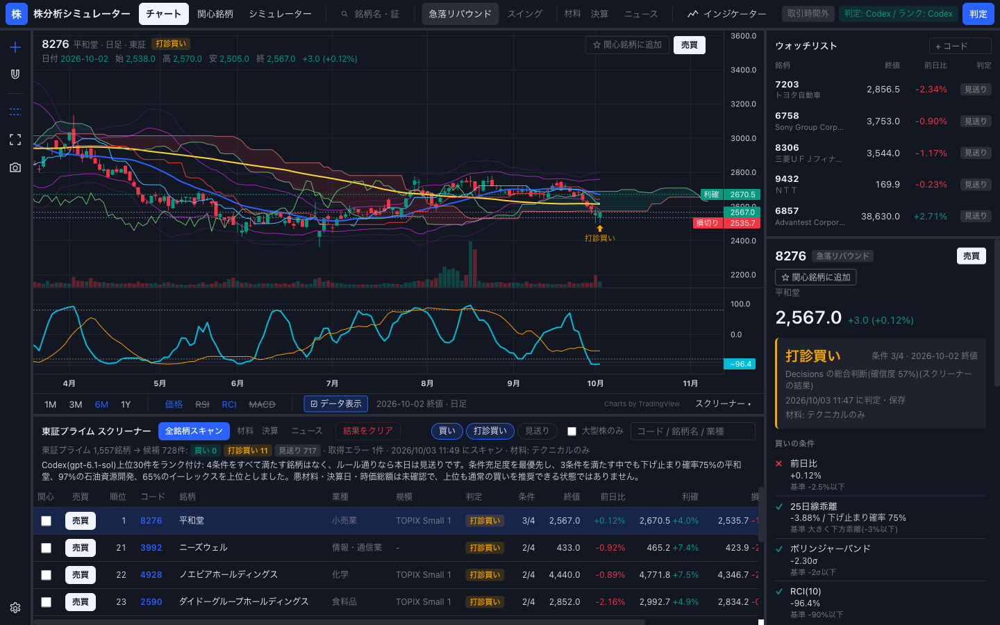
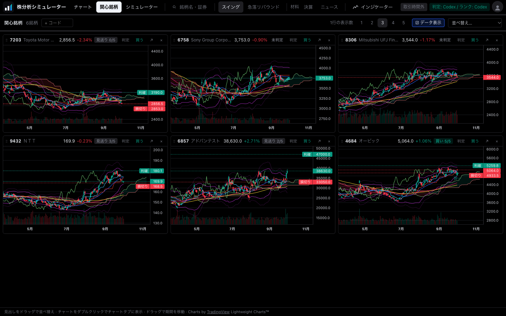
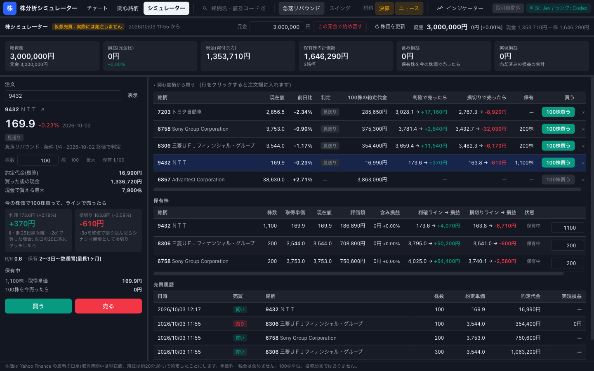

# 株分析シミュレーター

日本株を売買ルールに照らして「買い / 打診買い / 見送り」に判定し、有望な順に並べ、仮想売買で試せる株分析ツール（API サーバー + ブラウザ UI）。
リポジトリ名・パッケージ名は `stock-analyzer`。

> [!WARNING]
> このツールの判定は投資助言ではありません。利用はすべて自己責任です。詳しくは[免責事項](#免責事項)を参照してください。



## 機能

| 機能                | できること                                                                                  |
| ------------------- | ------------------------------------------------------------------------------------------- |
| 銘柄の判定          | 判定（買い / 打診買い / 見送り）と、根拠・懸念点・利確 / 損切りラインを出す                 |
| 全銘柄スキャン      | 東証プライム全銘柄（約1,560）を調べ、候補を判定して一覧にする                               |
| AI によるランク付け | 判定済みの上位30件を AI が見比べ、順位・スコア・理由を付ける                                |
| 売買ルール          | スイング（上昇トレンドの押し目買い、既定）/ 急落リバウンド（大型株の急落を狙う逆張り）      |
| 材料のチェック      | 決算が近い銘柄、悪材料のニュースが出ている銘柄を見送りにする                                |
| チャート            | TradingView 風の日足チャートと主なテクニカル指標。判定と利確 / 損切りラインを重ねて表示する |
| 関心銘柄            | ウォッチリストの銘柄のチャートを並べて見る                                                  |
| 株シミュレーター    | 元金を決めて仮想売買し、損益を確かめる（実際には発注しない）                                |
| 設定                | 判定に使う AI（Codex / Jev）と Codex のモデルを画面で切り替える                             |

AI に任せるのは、1銘柄ずつの判定（このツールでは Decisions と呼ぶ）と、複数銘柄のランク付けの2つである。
既定では、どちらも Codex App Server 経由の GPT-6 Luna に聞くので、API キーは要らない。判定は TypeSafe AI の Jev にも切り替えられる。
判定の考え方と売買ルールの中身は [DESIGN.md](DESIGN.md) にまとめている。

## 起動の仕方

### 必要なもの

| もの                    | バージョン | 用途                                                        |
| ----------------------- | ---------- | ----------------------------------------------------------- |
| Node.js                 | 24 以上    | API サーバーと UI                                           |
| pnpm                    | 12.8.1     | パッケージ管理（`package.json` の `packageManager` で固定） |
| Codex CLI               | 0.160 以上 | 判定とランク付け。ChatGPT アカウントでログインしておく      |
| TypeSafe AI の API キー | —          | 判定を Jev に切り替えるときだけ                             |

### 手順

```sh
git clone <このリポジトリの URL> stock-analyzer
cd stock-analyzer
pnpm install
codex login   # Codex CLI に ChatGPT アカウントでログイン(済みなら不要)
pnpm dev      # API http://localhost:3000 と UI http://localhost:5173 を起動
```

ブラウザで <http://localhost:5173> を開く。
右上に「判定: Codex / ランク: Codex」と出ていれば、AI を使える状態である。「(未接続)」が付いた方は使えていない。

判定を Jev に切り替えるときは、先に `.env.example` を `.env` にコピーし、`TYPESAFE_API_KEY` に [TypeSafe AI](https://console.typesafe.ai/keys) で発行したキーを書いてから、画面の設定で Jev を選ぶ。
`.env` は起動時に読み込まれ、`.gitignore` で除外している。

### AI を使えないとき

AI がなくても起動する。
判定の AI を使えなければ数値条件だけで判定し、Codex を使えなければランク付けをせずに判定順に並べる。
呼び出しに失敗したときも同じように動き、失敗の内容を画面と API の結果に出す。

### 環境変数

| 環境変数           | 既定     | 内容                                                   |
| ------------------ | -------- | ------------------------------------------------------ |
| `TYPESAFE_API_KEY` | なし     | Jev の API キー（判定の AI を Jev にするときだけ）     |
| `CODEX_BIN`        | `codex`  | Codex CLI のパス                                       |
| `DECISIONS_EFFORT` | `low`    | Codex での判定の推論の深さ                             |
| `RANK_EFFORT`      | `medium` | ランク付けの推論の深さ                                 |
| `DATA_DIR`         | `./data` | 判定結果・関心銘柄・シミュレーターの口座・設定の保存先 |
| `PORT`             | `3000`   | API サーバーのポート                                   |

### うまく動かないとき

| 症状                                                            | 対処                                                                                                     |
| --------------------------------------------------------------- | -------------------------------------------------------------------------------------------------------- |
| `pnpm install` が `ERR_PNPM_MISSING_TARBALL_INTEGRITY` で止まる | `pnpm-lock.yaml` の `xlsx` の integrity が消えている。`pnpm clean --lockfile && pnpm install` で作り直す |
| `ERR_PNPM_IGNORED_BUILDS`（esbuild）で止まる                    | `pnpm-workspace.yaml` の `allowBuilds` に esbuild があるか確認する                                       |
| 右上に「(未接続)」と出る                                        | Codex なら `codex --version`（0.160 以上か）と `codex login` を、Jev なら `TYPESAFE_API_KEY` を確認する  |

## 使い方（ブラウザ UI）

### よくある流れ

1. 上部で売買ルールを選ぶ（最初はスイング）
2. 下のスクリーナーで「全銘柄スキャン」を押す。全銘柄を判定し、上位30件を AI がランク付けする（数分かかる）
3. 「順位」の上位の銘柄を開き、右の「判定の詳細」で条件ごとの判定・売り方・ランク付けの理由を見る
4. 気になる銘柄は、調べたニュースを右下の欄に貼り、「ニュース込みで再判定」で悪材料がないか確かめる
5. 「関心」にチェックした銘柄を、関心銘柄タブで並べて見る
6. 「売買」を押し、仮想売買で利確 / 損切りラインでの損益を確かめる

### チャート画面

冒頭のスクリーンショットがチャート画面である。

| 場所           | できること                                                                                           |
| -------------- | ---------------------------------------------------------------------------------------------------- |
| 上部バー       | 銘柄検索、売買ルールと材料の切り替え、インジケーターの表示、AI の状態（押すと設定を開く）、判定      |
| チャート       | 日足とインジケーター、判定のマーカー、利確 / 損切りのライン。右上の「売買」で売買ダイアログを開く    |
| 左ツールバー   | 十字線、利確 / 損切りラインの表示、全体表示、スクリーンショット保存。一番下の歯車で設定を開く        |
| ウォッチリスト | 銘柄の追加・削除。終値・前日比・判定                                                                 |
| 判定の詳細     | 条件ごとの判定、売り方、ランク付けの順位と理由、判定の確率、懸念点                                   |
| スクリーナー   | 全銘柄スキャンの結果。判定・大型株・文字列で絞り込み、列で並べ替える。「売買」で売買ダイアログを開く |

インジケーターは、移動平均・ボリンジャーバンド・一目均衡表・出来高・RSI・RCI・MACD から選ぶ。初期表示は売買ルールごとに異なり、スイングは RSI・MACD、急落リバウンドは RCI を下の段に出す。
`http://localhost:5173/#7203` のように、URL で銘柄を指定して開ける。

### 関心銘柄タブ



ウォッチリストの銘柄のチャートを、1行に1〜5個ずつ並べる。
見出しをドラッグするか「並べ替え…」で順番を変え、チャートをダブルクリックするとチャート画面で開く。

### シミュレーター タブ（仮想売買）



元金（既定 100万円）から銘柄を買い、利確 / 損切りラインで売ったときの損益を見ながら売買の練習ができる。実際には発注しない。
約定単価は、注文した時点の最新の日足の終値（取引時間中は現在値、約20分遅れ）とする。手数料と税金は含めない。

タブを移らずに売買するときは、チャート右上・判定の詳細・スクリーナーの各行にある「売買」を押す。シミュレーターの注文欄と同じ内容がダイアログで開く。

### 材料（決算・ニュース）

上部の「材料」で決算とニュースをオンにすると、判定とスキャンで次の2つも調べる。

| 材料     | 取得元                                          | 判定での扱い                                                 |
| -------- | ----------------------------------------------- | ------------------------------------------------------------ |
| 決算     | JPX の決算発表予定日（なければ Yahoo の推定日） | 発表まで5営業日以内なら「見送り」                            |
| ニュース | Google ニュース（直近7日の見出し）              | 悪材料の確率が50%以上なら「見送り」。スキャンは1分ほど延びる |

### そのほかの機能

- 取引時間中（平日 9:00〜15:45）は、1分ごとに株価を取り直してチャートを更新する。判定は自動では出し直さない
- 設定（左下の歯車）で、判定に使う AI（Codex / Jev）と Codex のモデル（既定 `gpt-6-luna`）を切り替える。アプリのバージョンとライセンスもここに出る
- スマホ幅では、画面を1列に並べ、画面の切り替えタブを下に固定する

### 保存されるもの

判定結果・スキャン結果・関心銘柄・シミュレーターの口座・設定は `data/` に、表示の設定（売買ルールの選択やインジケーターなど）はブラウザに保存する。
`data/` は `.gitignore` で除外している。

## 使い方（API）

`strategy` は `swing`（省略時）か `rebound` を指定する。

### 全銘柄を調べる（`GET /screen`）

時間がかかる（急落リバウンドで候補728件のとき約4分。2026-10-03 計測）ので、進捗を SSE で返す。`&earnings=1` `&news=1` で材料を足す。

```sh
curl -sN 'localhost:3000/screen?strategy=swing' | jq -R --unbuffered -r '
  select(startswith("data: ")) | .[6:] | fromjson
  | if .phase then "\(.phase) \(.done)/\(.total)"
    else {summary, ranking, top: [.results[:10][] | {code, name, verdict, satisfied, ranking}]} end'
```

`-N` を付けないと、curl が出力をためてしまい、進捗がまとめて表示される。

| イベント   | data                                                                          | 送るタイミング           |
| ---------- | ----------------------------------------------------------------------------- | ------------------------ |
| `progress` | `{"phase","done","total"}`。phase は `listing` / `analyze` / `judge` / `rank` | 各段階の 5% 刻みと完了時 |
| `result`   | 全結果（`summary` / `ranking` / `results` / `errors` など）                   | 最後に1回                |
| `error`    | `{"error"}`                                                                   | 銘柄一覧の取得失敗など   |

明らかに見送りの銘柄は結果に含めない（基準は [DESIGN.md](DESIGN.md#銘柄の選び方)）。
各結果には JPX の業種（`sector`）と規模区分（`scale`）が付くので、大型株に絞るなら `scale` が `TOPIX Core30` / `TOPIX Large70` のものを見る。

### 銘柄を指定して調べる（`POST /judge`）

```sh
curl -s -X POST localhost:3000/judge \
  -H 'Content-Type: application/json' \
  -d '{"strategy":"swing","codes":["7203","6758","8306"],"news":{"7203":"特に目立ったニュースなし"},"options":{"earnings":true}}'
```

`news` には銘柄ごとに調べたニュースを、`options` には自動で調べる材料（`earnings` / `news`）を入れる。どちらも省略できる。
2銘柄以上なら AI がランク付けし、その順で返す（5銘柄で約35秒）。

| 項目                                 | 内容                                                                                         |
| ------------------------------------ | -------------------------------------------------------------------------------------------- |
| `verdict` / `reason`                 | 判定と、その理由                                                                             |
| `rationale` / `concerns`             | 満たした条件（買いの根拠）と、満たしていない条件・未確認の項目・AI の失敗（懸念点）          |
| `sellPlan`                           | 利確・損切りの価格と変化率、保有中に見る指標、リスクリワード（第1目標までの値幅 ÷ 損切り幅） |
| `checks` / `technicals` / `decision` | 条件ごとの判定、テクニカル指標、Decisions の答え                                             |
| `ranking`                            | ランク付けの順位・スコア・理由（2銘柄以上を判定したときの上位30件だけ）                      |

## 開発用コマンド

| コマンド          | 内容                                 |
| ----------------- | ------------------------------------ |
| `pnpm dev`        | API と UI を起動（変更を監視）       |
| `pnpm start`      | API サーバーだけ起動                 |
| `pnpm typecheck`  | 型チェック                           |
| `pnpm ui:build`   | UI を `ui/dist` にビルド             |
| `pnpm ui:preview` | UI をビルドして API サーバーから配信 |

コードの構成と売買ルールの増やし方は [DESIGN.md](DESIGN.md#コードの構成) を参照。

## データの出どころ

| データ                     | 取得元                                                            |
| -------------------------- | ----------------------------------------------------------------- |
| 日足・現在値・決算予定     | Yahoo Finance（非公式の API。東証は約20分遅れ）                   |
| 上場銘柄一覧・決算発表予定 | [JPX（日本取引所グループ）](https://www.jpx.co.jp/)の公開ファイル |
| ニュース見出し             | Google ニュースの RSS                                             |

いずれも各サービスの利用規約の範囲で、個人の用途に限って使う（Google ニュースの RSS は個人の閲覧用途に限られる）。
`/screen` は1回で Yahoo Finance に約1,560件のリクエストを送るので、短時間に何度も実行しない。

## 参考文献

判定ルールと指標の根拠にした文献・資料。ルールの中身は [DESIGN.md](DESIGN.md#銘柄の選び方) を参照。
これらは考え方や指標の定義の出典であり、このツールの判定が利益を生むことを示すものではない。

### スイング（順張り・押し目買い）

- N. Jegadeesh, S. Titman, "Returns to Buying Winners and Selling Losers: Implications for Stock Market Efficiency", _The Journal of Finance_, 48(1), 65–91, 1993. [doi:10.1111/j.1540-6261.1993.tb04702.x](https://doi.org/10.1111/j.1540-6261.1993.tb04702.x) — 上昇してきた銘柄はその後も上がりやすい（モメンタム）
- W. Brock, J. Lakonishok, B. LeBaron, "Simple Technical Trading Rules and the Stochastic Properties of Stock Returns", _The Journal of Finance_, 47(5), 1731–1764, 1992. [doi:10.1111/j.1540-6261.1992.tb04681.x](https://doi.org/10.1111/j.1540-6261.1992.tb04681.x) — 移動平均を使った売買ルールの検証
- [20 Moving Average Pullback Strategy](https://www.tradingsim.com/blog/20-moving-average-pullback)（TradingSim） — 上向きの移動平均までの押し目で、反転を確認して買う
- [株のスイングトレードで勝つための10の必須ルール](https://crexgroup.com/ja/sec/stock-investment/swing-trade-rules/)（証券会社比較なび） — 損切り・利確目標を先に決める、順張りを基本にする

### 急落リバウンド（逆張り）

- W. F. M. De Bondt, R. Thaler, "Does the Stock Market Overreact?", _The Journal of Finance_, 40(3), 793–805, 1985. [doi:10.1111/j.1540-6261.1985.tb05004.x](https://doi.org/10.1111/j.1540-6261.1985.tb05004.x) — 劇的なニュースに投資家が過剰反応し、売られすぎた銘柄がのちに戻る（過剰反応仮説）
- N. Jegadeesh, "Evidence of Predictable Behavior of Security Returns", _The Journal of Finance_, 45(3), 881–898, 1990. [doi:10.1111/j.1540-6261.1990.tb05110.x](https://doi.org/10.1111/j.1540-6261.1990.tb05110.x) — 短期の値動きは反転しやすい（短期リバーサル）

### テクニカル指標

| 指標                | 文献                                                                                                                                                                                                     |
| ------------------- | -------------------------------------------------------------------------------------------------------------------------------------------------------------------------------------------------------- |
| RSI・ATR            | J. Welles Wilder Jr., _New Concepts in Technical Trading Systems_, Trend Research, 1978. [Internet Archive](https://archive.org/details/newconceptsintec00wild)                                          |
| MACD                | Gerald Appel, _Technical Analysis: Power Tools for Active Investors_, FT Press, 2005. [出版社のページ](https://www.informit.com/store/technical-analysis-power-tools-for-active-investors-9780131479029) |
| ボリンジャーバンド  | John Bollinger, [Bollinger Bands](https://www.bollingerbands.com/bollinger-bands)（考案者による解説）                                                                                                    |
| RCI（順位相関指数） | C. Spearman, "The Proof and Measurement of Association between Two Things", _The American Journal of Psychology_, 15(1), 72–101, 1904（RCI の元になったスピアマンの順位相関）                            |
| 一目均衡表          | 一目山人（細田悟一）『一目均衡表』（考案者による原典）                                                                                                                                                   |

## 免責事項

- このツールは、あらかじめ決めた売買ルールに照らして機械的に判定するサンプルであり、**投資助言・投資勧誘ではない**。特定の銘柄の売買を勧めるものではない
- 判定・ランキング・利確 / 損切りライン・シミュレーターの損益などの出力は、AI と外部のデータに基づくもので、正確さ・完全さ・最新であること・有用であることを一切保証しない。株価は遅延しており、AI の答えは誤ったり、実行ごとに変わったりする
- このツールの利用と投資の最終判断は、すべて利用者自身の判断と責任で行う
- 作者（hobbydevelop）およびコントリビューターは、このツールの利用または利用できなかったことによって生じた**いかなる損害（投資による損失を含む）についても、一切の責任を負わない**
- 外部サービス（Yahoo Finance・JPX・Google ニュース・OpenAI / Codex・TypeSafe AI）は、それぞれの利用規約に従って使う。規約違反やアカウントへの影響についても、作者は責任を負わない
- ソフトウェアとしての保証の否認は [LICENSE](LICENSE)（MIT）にも定めている

## コントリビュート

Issue・Pull Request を歓迎する。Pull Request の前に、CI と同じ `pnpm typecheck` と `pnpm ui:build` を通しておく。
AI エージェント（Codex / Claude Code など）向けの作業ルールは [AGENTS.md](AGENTS.md) にまとめている。

## ライセンス

[MIT](LICENSE)。チャートには TradingView の [lightweight-charts](https://github.com/tradingview/lightweight-charts)（Apache-2.0）を使っており、ライセンスに従って画面内に帰属表示（Charts by TradingView）を出している。
