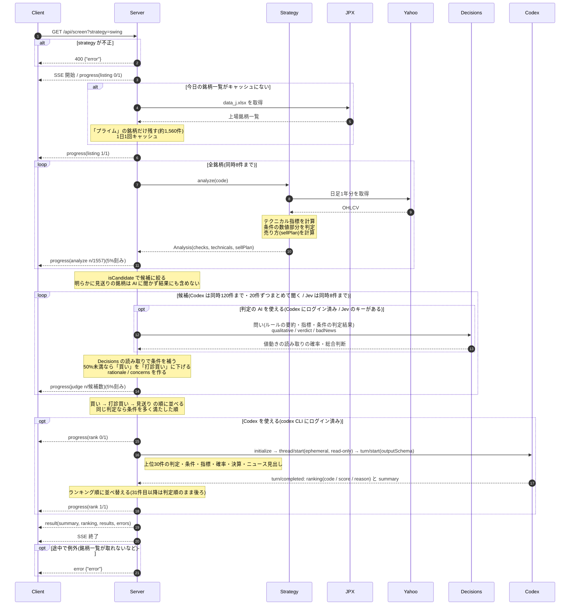
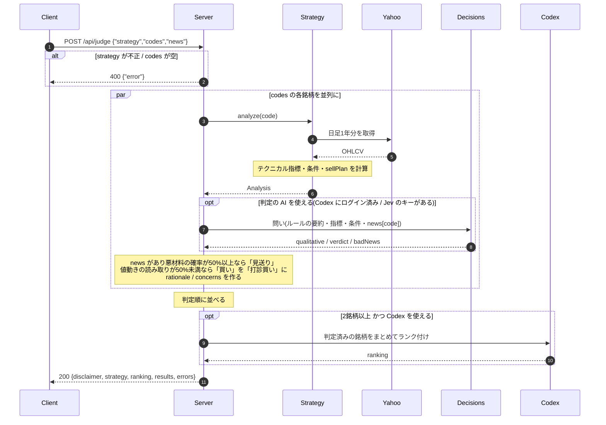
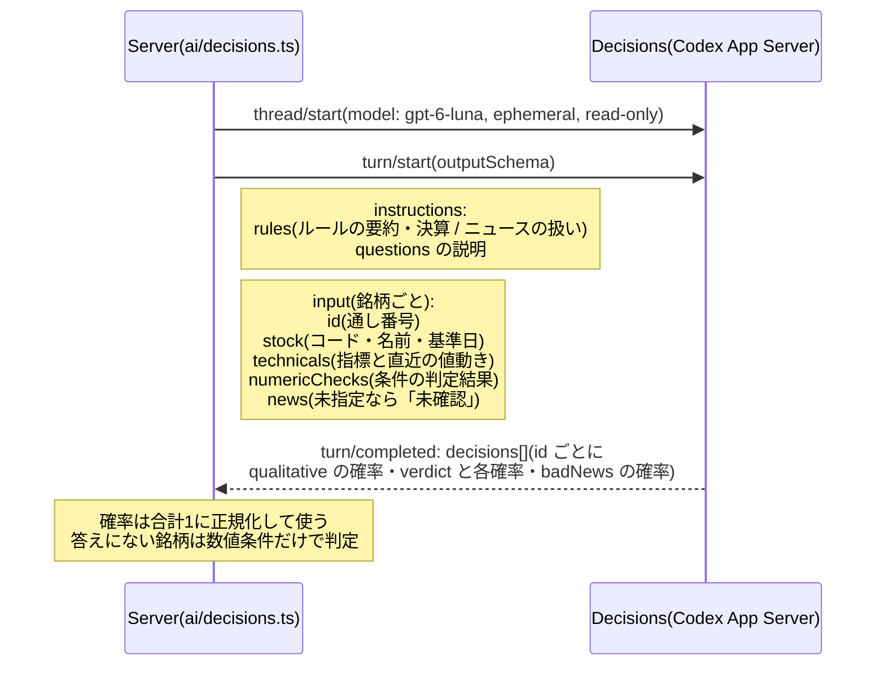

# シーケンス図

`/api/screen`（東証プライム全銘柄）と `/api/judge`（銘柄を指定）で、サーバー内部と外部サービスの間で何が起きるかを示す。
参加者とソースコードの対応は次のとおり。

| 参加者   | 実体                                                          |
| -------- | ------------------------------------------------------------- |
| Client   | 画面、または curl など(ログインの Cookie を付ける)            |
| Server   | `src/server/api.ts`（Hono。TanStack Start の `/api/*` から呼ばれる）                                       |
| Strategy | `src/server/strategies/rebound.ts` / `swing.ts`（`strategy` で選ぶ） |
| JPX      | 東証上場銘柄一覧（`data_j.xlsx`）。`src/server/prime.ts` が取得      |
| Yahoo    | Yahoo Finance chart API（日足）。`src/server/technicals.ts` が取得   |
| Decisions | 銘柄ごとの判定。Node の既定は Codex App Server 経由の GPT-6 Luna、Cloudflare Workers の既定は Workers AI(`src/server/ai/decisions-batch.ts`)。設定で Jev を選んだら TypeSafe AI の Jev(`src/server/ai/decisions-jev.ts`) |
| Codex    | ランク付け。Codex App Server(`codex app-server`、stdio の JSON-RPC)の GPT-6 Luna。Codex を使えない Workers では Workers AI(`src/server/ai/ranking.ts`) |

## `/api/screen`: 東証プライム全銘柄を調べる

進捗を SSE で返し、最後に全結果を `result` イベントで返す。所要時間は約40〜50秒(AI の判定とランク付けを含めるとさらに延びる)。

- 個々の銘柄の取得や判定に失敗しても全体は止めず、`errors` に入れて続ける。
- `/api/screen` ではニュースを渡せないので、`badNews` の答えは使わない（`materialChecked: false`）。

## `/api/judge`: 銘柄を指定して調べる

指定した銘柄を並列に調べ、まとめて JSON で返す。候補の絞り込みはしない（指定した銘柄はすべて結果に入る）。

- `news` を渡した銘柄だけ、Decisions の `badNews`（悪材料の確率）を判定に使う。
- 存在しないコードなど、取得できなかった銘柄は `errors` に入る。

## Decisions に渡すもの・返ってくるもの(Codex の場合)

Jev の場合は、同じ内容を1銘柄ずつ `systemOne`(state と questions: qualitative=noul / verdict=choice / badNews=noul)で送る。

どちらのエンドポイントでも、銘柄をためて20件ずつ1ターンにまとめ、各銘柄について3つの質問を聞く(同時に6ターンまで)。
Codex App Server のプロセスは1つを使い回し、ターンごとに使い捨てのスレッドを作る。

